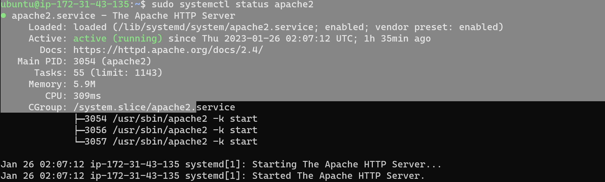
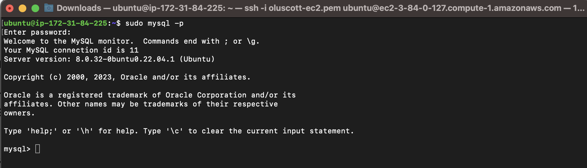
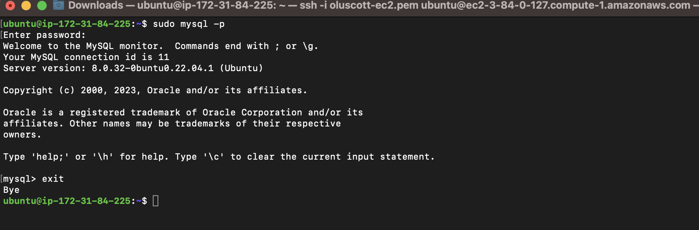
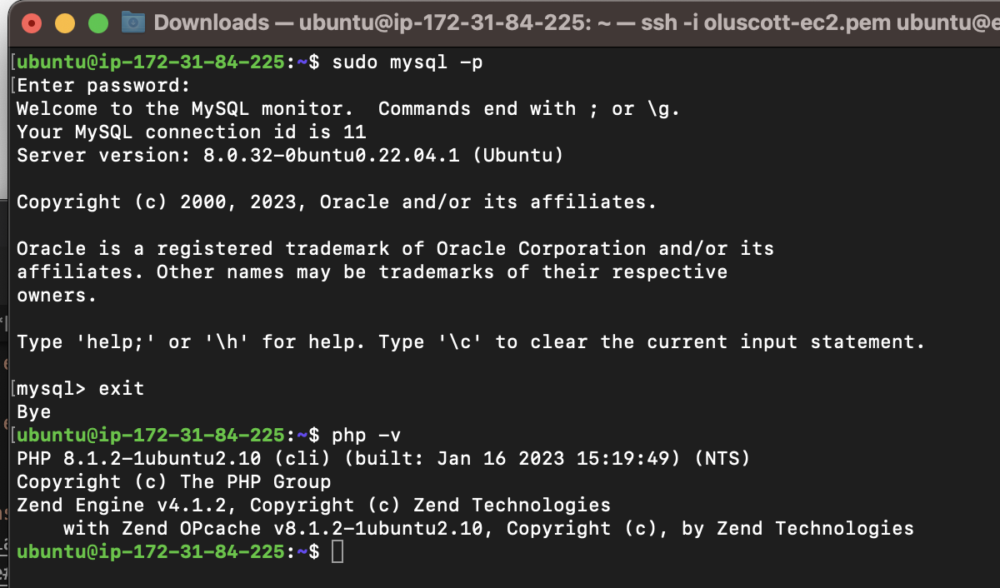

## **Project one Documentation**

### **Installing Apache and Updating the Firewall**

**Install Apache using Ubuntu’s package manager**

**update a list of packages in package manager**

`sudo apt update`

**run apache2 package installation**

`sudo apt install apache2`

**To verify that apache2 is running as a Service in our OS, use following command**

`sudo systemctl status apache2`

.[Apache HTTP Server Project](https://httpd.apache.org/)

.[Domain Name System](https://en.wikipedia.org/wiki/Domain_Name_System)

.[HTML](https://en.wikipedia.org/wiki/HTML)

### **Installing MYSQL**

**use ‘apt’ to acquire and install this software**

`sudo apt install mysql-server`

**When the installation is finished, log in to the MySQL console by typing**

`sudo mysql`

**log in to the MySQL console by typing**

`sudo mysql -p`

**To exit the MySQL console**

`mysql> exit`

.[Database management system](https://en.wikipedia.org/wiki/Database#Database_management_system)

.[Relational Database](https://en.wikipedia.org/wiki/Relational_database)

### **Installing PHP**

**To install these 3 packages at once, run**

`sudo apt install php libapache2-mod-php php-mysql`

**Once the installation is finished**

`php -v`

.[PHP](https://www.php.net/)

.[Markdown](https://www.markdownguide.org/cheat-sheet/)

.[Markdown](https://learn.microsoft.com/en-us/contribute/markdown-reference)

**End**